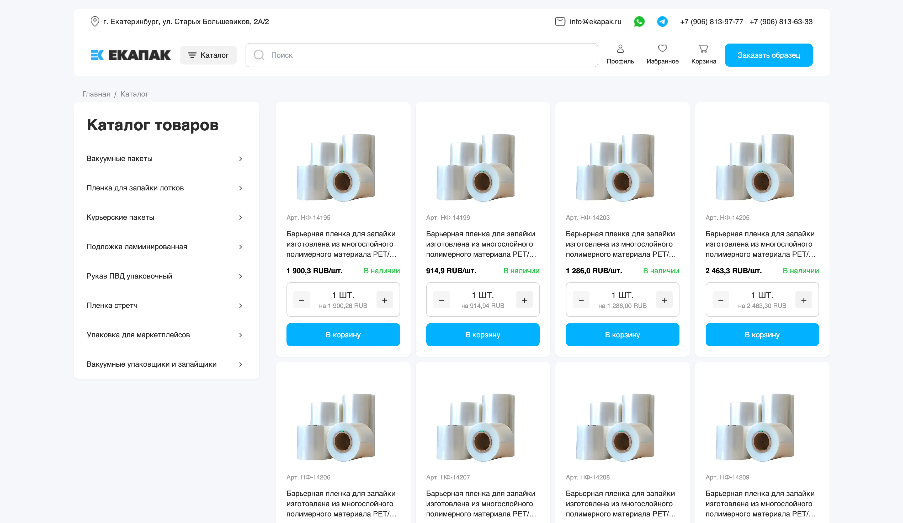
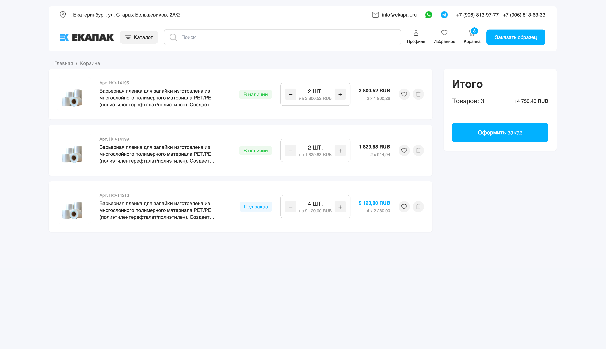
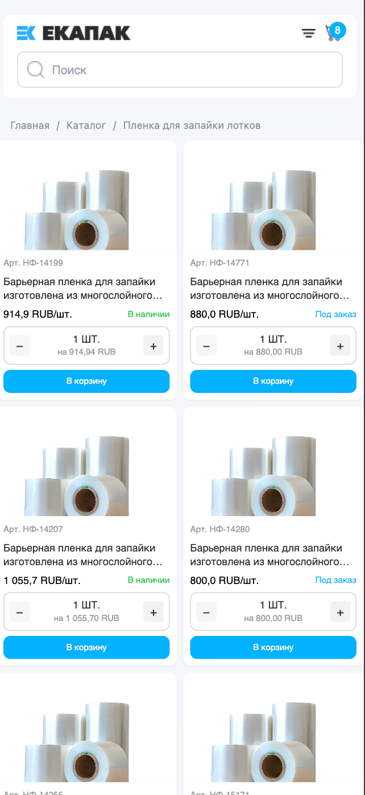
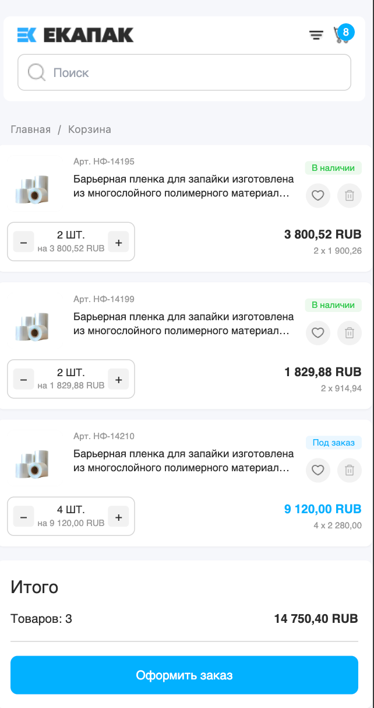

# EKAPAK

Проект состоит из фронтенда (Next.js) и бэкенда (Laravel API).

## Backend - Laravel API

### Быстрый запуск

```bash
cd backend

# 1. Настройка .env (проверьте настройки БД)
# - DB_USERNAME
# - DB_PASSWORD
# - DB_DATABASE

# 2. Установка зависимостей, создание БД и запуск миграций
composer setup

# 3. Запуск сервера разработки
php artisan serve
```

**Требования:** PHP >= 8.2, PostgreSQL, Composer

### Что реализовано

- API для создания платежей (`POST /api/payments`)
- API для получения информации о платеже (`GET /api/payments/{uuid}`)
- API для обработки платежей (`POST /api/payments/{uuid}/process`)
- Валидация через Form Request классы
- Валидация UUID в параметрах роутов
- Обработка ошибок с понятными сообщениями
- Rate Limiting через middleware для защиты API

## Frontend - Next.js приложение

Frontend приложение на Next.js с полным SSR, Redux для корзины и серверной пагинацией.

## Установка

```bash
cd frontend
npm install
```

## Запуск в режиме разработки

```bash
npm run dev
```

Откройте [http://localhost:3000](http://localhost:3000) в браузере.

## Структура проекта

- `app/` - страницы и роутинг Next.js (App Router)
  - `catalog/[[...slug]]/` - каталог товаров с поддержкой категорий
  - `product/[slug]/` - страница товара
  - `basket/` - страница корзины
- `components/` - React компоненты
  - `header/` - компоненты хедера (Header, HeaderSearch, HeaderBasketIcon)
  - `product/` - компоненты товаров (ProductCard, ProductDetails, ProductActions)
- `hooks/` - кастомные хуки (useProduct)
- `store/` - Redux store и slices (только корзина)
- `types/` - TypeScript типы
- `utils/` - утилиты (api, constants, price, search, debounce)

## Технологии и решения

### Основной стек

- **Next.js 14** (App Router) - SSR, роутинг
- **TypeScript** - строгая типизация для всех данных из API
- **Redux Toolkit** - управление состоянием (только корзина)
- **React Query (TanStack Query)** - кеширование данных
- **Tailwind CSS** - CSS фреймворк

### Архитектурные решения

- **SSR** - страницы рендерятся на сервере
- **ISR (Incremental Static Regeneration)** - страницы обновляются каждые 60 секунд (товары) и 300 секунд (категории)
- **Серверная фильтрация** - поиск товаров выполняется на сервере через URL параметры (`?search=...`)
- **Серверная пагинация** - пагинация реализована на сервере (4 товара на страницу)
- **Debounce для поиска** - оптимизация обновления URL при вводе текста (300ms задержка)
- **Адаптивный дизайн** - для мобилок и десктопа через Tailwind классы

## Изображения интерфейса





